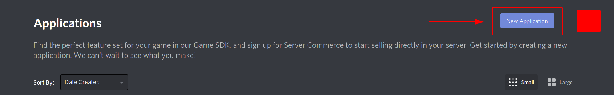
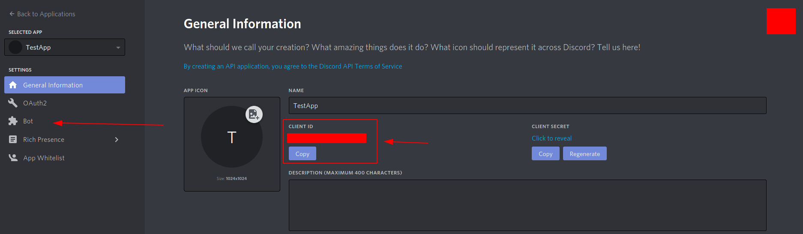
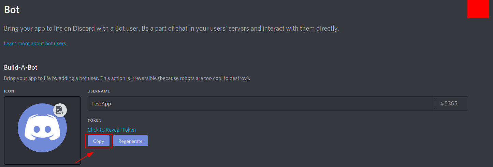
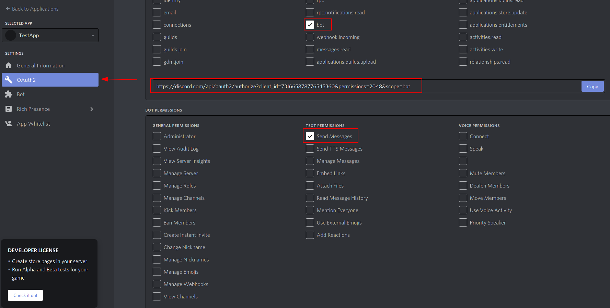
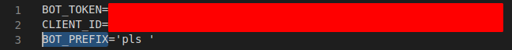

# Microverse Ruby Capstone | Discord Bot

Microverse capstone project designed to evalue the student's ability to:
- Work under pressure
- Manage time properly
- Solve problems effectively
- Code solutions using Ruby best practices.

This project requirement was to build a bot for a platform, I choosed discord as the platform.

This discord bot is a dice roll bot intended to help D&D players to have a good time while having a call. 
This bot is able to catch chat commands, and throw dices accordingly in a chat server, then it mentions the user with the results.

## Technologies used

- Ruby
- RSpec
- VS Code

**Installed gems**

- Dotenv
- Discordrb

## Requirements

- Ruby
- Dotenv
- Discordrb

### Installing the required gems

**On linux**

On a bash command line type:

>gem install dotenv  
>gem install discordrb

### Setting the environment variables and the bot

**Setting the bot**
First you will need a Discord account. If you don't have one, register [here](https://discord.com/new)  

Download the Discord app, and create a server. If you don't know how to create a discord server, take a look [here](https://www.howtogeek.com/364075/how-to-create-set-up-and-manage-your-discord-server/)

Then go to the [Discord application page](https://discord.com/developers/applications) while logged with your account.

Click the application button of the top right corner.

You will need the client ID. Now click on the bot tab on the left and create your bot. Pick a name and create your bot.

You will need the bot token for it to work

In the auth tab on the left, set the app type to bot, and set the permissions, the bot needs the permissions to send messages. After you set the permissions copy the link and open it, it will lead you to the add bot page, so you can add the bot to the server of your preference.

**Setting the environment variables**

Steps:

- Create a .env file in the project root folder
- Create a variable called "BOT_TOKEN" and store the bot token there.
- Create a variable called "CLIENT_ID" and store the client ID from the application page there.
- Create a variable called "BOT_PREFIX" and store a string there, that's the prefix needed to give the roll command to the bot.

*Note: The prefix in the example is 'pls ', but it can be as simple as '!' or '-', the choice is yours.*

## Bot usage

The require commands as follows to work properly: [your prefix] + "roll" + dice + [other modifiers or dices].
- **Example of a proper command:** "pls roll 4d6 + 5 + d4".
- **Example of an invalid command:** "pls roll 4** | "pls roll d5" 
*Note: the bot will only execute the commands with proper dices: 4, 6, 8, 10, 12, 20 and 100*

In case you require to throw dices with advantage or disadvantage you should add the words 'adv' or 'dis' (in case both are used the bot will thow as normal).
- **Example of a proper throw with advantage:** "pls roll d20 + 4 + d4 adv"
- **Example of an invalid throw with advantage:** "pls roll adv"
- **Example of a proper throw with disadvantage:** "pls roll d20 + d4 dis"
- **Example of an invalid throw with disadvantage:** "pls roll dis" 
*Note: in case you roll a dice different dice from a d20 with advantage the roll will go as normal*

## Bot behavior and message validation

The bot checks if the message recieved is a valid one, in case the message recieved is valid the bot will execute the command. 
If the command is not a valid one the bot will ignore the command and won't execute it. This is because the discord bots are intended for crowded chat rooms  and responding with error messages everytime an user types a wrong command could result in chat spam and confussion.

Check for example the behavior of [Dash Delta](https://dashdelta.tech/)

## Running test cases

Go to the project root folder and type "rspec --format documentation" to run the test cases.

## Developer

- Github: [@alvp01](https://github.com/alvp01)
- Twitter: [@alvp01](https://twitter.com/alvp01)

### Extra material

- One [article](https://medium.com/@goodatsports/how-to-make-a-simple-discord-bot-in-ruby-to-annoy-your-friends-f5d0438daa70) on how to make a discord bot.
- Another [article](https://medium.com/@albert.palka/build-discord-bot-in-minutes-using-discordrb-gem-fa2da38668bb) about how to build a ruby bot and deploy it with heroku.